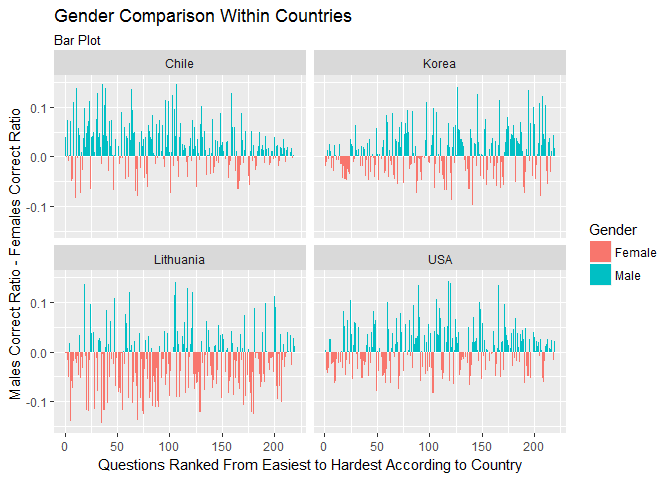
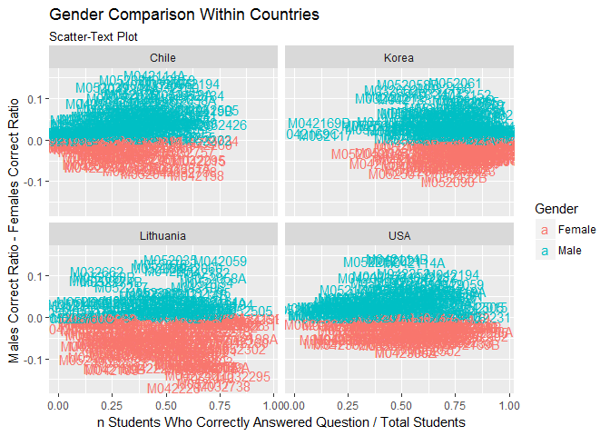
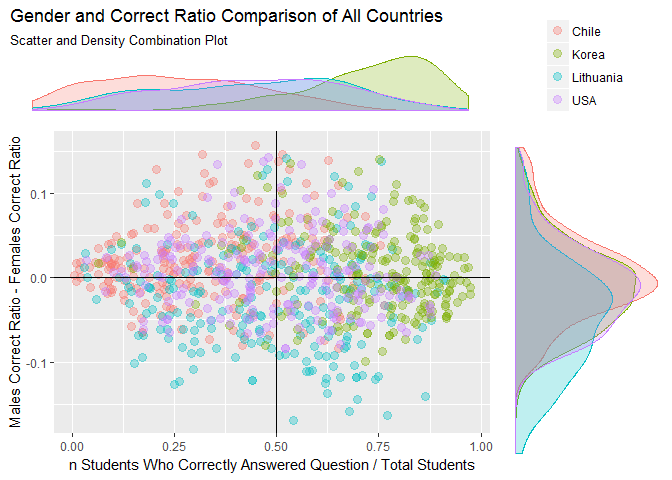
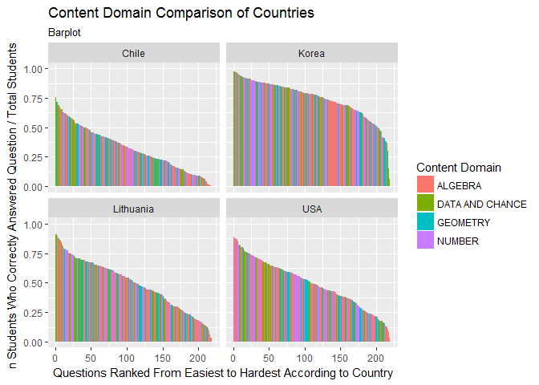
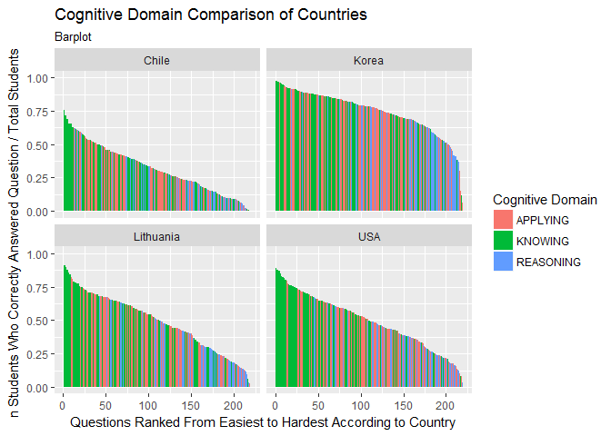
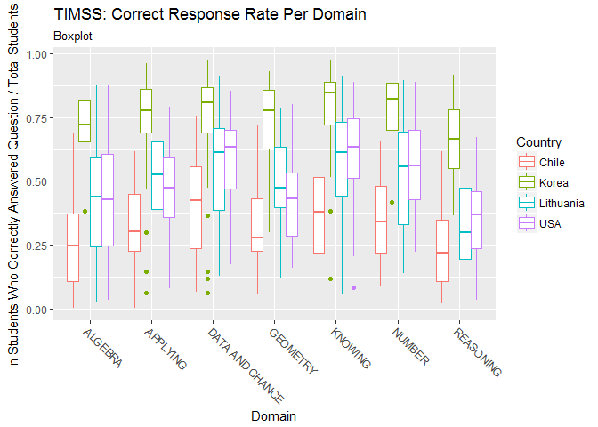
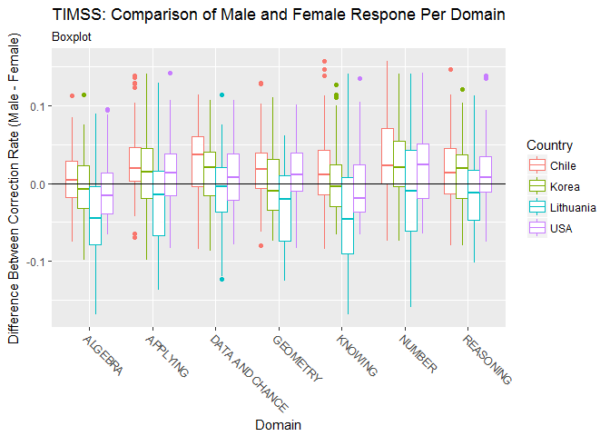
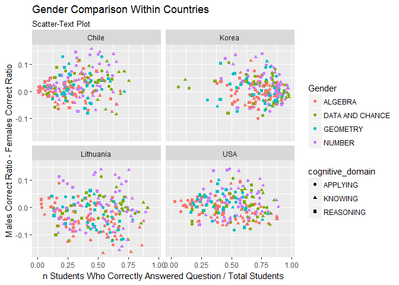
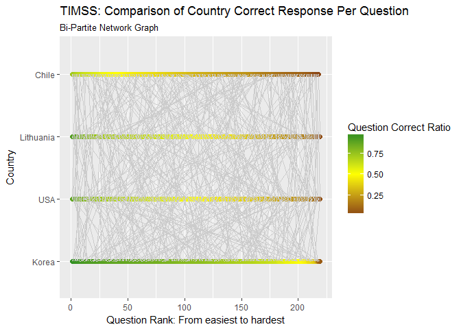

-   [Introduction](#introduction)
    -   [Tidy Data](#tidy-data)
    -   [Obtaining Data](#obtaining-data)
-   [Cleaning Data](#cleaning-data)
-   [Visualization](#visualization)
-   [Conclusion](#conclusion)

Introduction
------------

The **Trends in International Math and Science Study (TIMSS)** is a
series of international assessments of the mathematics and science
knowledge of students around the world. It is administered by both the
**International Association for the Evaluation of Educational
achievement (IEA)** and **Boston College (BC)** who first conducted the
assessments in 1995 and re-administered them every 4 years after that
(1999, 2003, 2007, 2011, and 2015). Different versions of the
assessments are given to 4th graders and 8th graders of participating
countries. Each question in the assessment test the students' grasp of
different cognitive and content domains. Every assessment contains both
multiple choice and free-response style questions. After the test is
given, each student who has taken the test is given a performance score
ranging from 0 as the lowest to 1000 as the highest, with 500 being the
intended international mean. Each participating country, in turn, is
given a performance score which is the average of all of its students'
scores. The study uses the scores 625, 550, 475, and 400 to represent
advanced, high, intermediate, and low international benchmarks
respectively. That is, a student with a performance score greater than
625 is considered to have an advanced grasp of either math or science
while a student with a performance score less than 400 is considered to
have a below low grasp of either math or science.

The primary purpose of this article is to show different methods for
visualizing the **2011 TIMSS Math Assesment** given to 8th grade
students of the Republic of Korea, Lithuania, the United States of
America, and Chile. In particular, this article will focus on
visualizing the typical response provided by students of each country to
each question asked. Visualizing question-level data will hopefully lead
to better analysis of a country's educational needs. Korea was chosen
because it performed the best of all 45 participating countries with a
performance score of 613. Lithuania was chosen because it performed just
above the TIMSS scale centerpoint with a score of 502. Both the USA and
Chile were chosen because they are countries of personal interest with
scores of 509 and 416 respectively.[1]

It is worth noting, however, that the IEA and BC consider countries with
more than 15% of students scoring less than 400 as countries that can
not be reliably assessed. This is because such a high rate of below low
performers suggest an increased probability of random guessing. If we
eliminate all the countries that could not be reliably assessed, then
the country with the lowest performance score is Chile, one of the two
countries of personal interest.

The secondary purpose of this article is to **tidy** the datasets
provided by IEA. The new **tidy** datasets will facilitate the
visualization of data in this article as well as facilitate the
statistical modelling that will be done in a future article.
Unfortunately, there are few articles online which talk about analyzing
and cleaning the dataset in R. The **Cleaning Data** section is meant as
a resource for researchers who would like to analyze the TIMSS dataset
in R. For everyone else, the section can be summarized as a repetition
of the following code:

    dataframe %>%
      group_by(column_of_interest) %>%
      nest() %>%
      mutate(
        new_column = lapply(.$data, anonymous_function) %>%
          unlist()) %>%
      unnest()

Feel free to skip directly to the data visualization section if data
tidying does not fill you up with joy...

### Tidy Data

According to Hadley Wickham, tidy data is "a standard way of mapping the
meaning of a dataset to its structure. A dataset is messy or tidy
depending on how rows, columns and tables are matched up with
observations, variables and types. In tidy data:

1.  Each variable forms a new column.
2.  Each observation forms a row.
3.  Each type of observational unit forms a table.[2]

This article will attempt to tidy the TIMSS dataset as much as possible,
however, the nesting capabilities of the `tidyr` package makes it very
tempting to keep all observations in a single table. If all information
is kept in one table, then there is a greater chance that multiple
observations will be contained in a single row.

The TIMSS dataset that this article works on can be divided into 3 main
types of observational units. These observational units are measured at
the **Student**, **Book**, and **Question** level. The focus of this
article is question-level data, however, rich question-level data cannot
be derived without first organizing the TIMSS dataset at the student and
book levels. With `tidyr` each observational unit can be stored in a
single dataframe. Tidy data tables can be derived from this single
dataset with three simple commands

    dataframe %>%
      group_by(column_representing_observational_unit) %>%
      nest()

Therefore the single dataframe this article creates will only be three
commands away from a truly tidy dataset.

### Obtaining Data

IEA has a data repository where it publicly displays study data. It can
be accessed by going to <http://rms.iea-dpc.org/>. The order of clicks
goes in the order of SEARCH &gt; TIMSS &gt; Grade 8 &gt; 2011 &gt;
Chile::Student Test Responses &gt; Korea, Rep. of::Student Test
Responses &gt; Lithuania::Student Test Responses &gt; United
States::Student Test Responses &gt; SPSS &gt; Codebooks &gt; Download
Name:::Whatever &gt; Add To Basket &gt; View Basket &gt; (disk/save
icon)

The student achievement books contain student level information such as
student responses to each question, the students' gender, and the
students' school. The IEA naming convention for data files is:

-   Begin with 'a' for 4th grade tests or 'b' for 8th grade tests
-   Then 'sa' for student achievement files
-   A three letter string representing the country or 'tms' for
    a codebook.
-   End with 'm5' representing that this is the 5th administration of
    TIMS

so `bsachlm5` represents the 2011 8th grade student achievement test for
chile and `bsatmsm5` represents the 2011 8th grade student achievement
codebook.

Cleaning Data
-------------

The student achievement books need to be cleaned and manipulated in a
way that facilitates visualization. Furthermore, the cleaned data should
be useful for other types of analysis such as statistical modeling.
Therefore, the cleaning process will aim to both optimize for
visualization (for this article) and for statistical modelling (future
articles)

The principle packages used in this article will be `tidyverse`, and
`stringr`. The `tidyverse` package is important because it includes the
`dplyr` (cleaning), `tidyr` (cleaning) and `ggplot` (visualizing)
packages as well as the `magrittr` (%&gt;%) package. `The stringr`
package is important because of its text/string manipulation
capabilities. Other packages used are `haven`, `readxl`, and
`gridExtra`.

    library(tidyverse)
    library(stringr)

    library(haven)

    chl_achievement_11 <- read_spss('bsachlm5.sav')
    kor_achievement_11 <- read_spss('bsakorm5.sav')
    ltu_achievement_11 <- read_spss('bsaltum5.sav')
    usa_achievement_11 <- read_spss('bsausam5.sav')

    detach(package:haven)

The student achievement books are in wide format. Each row represents
one student and each column represents either a question or student
information. The books include both math and science questions as well
as student performance scores, school and student IDs, gender, and test
information.

    dim(chl_achievement_11)

    ## [1] 5835  581

    names(chl_achievement_11)

    ##   [1] "IDCNTRY"  "IDBOOK"   "IDSCHOOL" "IDCLASS"  "IDSTUD"   "M032166" 
    ##   [7] "M032721"  "M032757"  "M032760A" "M032760B" "M032760C" "M032761" 
    ##  [13] "M032692"  "M032626"  "M032595"  "M032673"  "M052216"  "M052231" 
    ##  [19] "M052061"  "M052228"  "M052214"  "M052173"  "M052302"  "M052002" 
    ##  [25] "M052362"  "M052408"  "M052084"  "M052206"  "M052429"  "M052503A"
    ##  [31] "M052503B" "M042032"  "M042031"  "M042186"  "M042059"  "M042236" 
    ##  [37] "M042226"  "M042103"  "M042086"  "M042228"  "M042245"  "M042270" 
    ##  [43] "M042201"  "M042152"  "M042269"  "M042179"  "M042177"  "M042207" 
    ##  [49] "M052209"  "M052142"  "M052006"  "M052035"  "M052016"  "M052064" 
    ##  [55] "M052126"  "M052103"  "M052066"  "M052041"  "M052057"  "M052417" 
    ##  [61] "M052501"  "M052410"  "M052170"  "M032094"  "M032662"  "M032064" 
    ##  [67] "M032419"  "M032477"  "M032538"  "M032324"  "M032116"  "M032100" 
    ##  [73] "M032402"  "M032734"  "M032397"  "M032695"  "M032132"  "M042041" 
    ##  [79] "M042024"  "M042016"  "M042002"  "M042198A" "M042198B" "M042198C"
    ##  [85] "M042077"  "M042235"  "M042067"  "M042150"  "M042300B" "M042300A"
    ##  [91] "M042300Z" "M042260"  "M042169A" "M042169B" "M042169C" "M032352" 
    ##  [97] "M032725"  "M032683"  "M032738"  "M032295"  "M032331"  "M032623" 
    ## [103] "M032679"  "M032047"  "M032398"  "M032507"  "M032424"  "M032681A"
    ## [109] "M032681B" "M032681C" "M052413"  "M052134"  "M052078"  "M052034" 
    ## [115] "M052174A" "M052174B" "M052130"  "M052073"  "M052110"  "M052105" 
    ## [121] "M052407"  "M052036"  "M052502"  "M052117"  "M052426"  "M042183" 
    ## [127] "M042060"  "M042019"  "M042023"  "M042197"  "M042234"  "M042066" 
    ## [133] "M042243"  "M042248"  "M042229A" "M042229B" "M042229Z" "M042080A"
    ## [139] "M042080B" "M042120"  "M042203"  "M042264"  "M042255"  "M042224" 
    ## [145] "M052017"  "M052217"  "M052021"  "M052095"  "M052094"  "M052131" 
    ## [151] "M052090"  "M052121A" "M052121B" "M052042"  "M052047"  "M052044" 
    ## [157] "M052422A" "M052422B" "M052505"  "M042015"  "M042196"  "M042194" 
    ## [163] "M042114A" "M042114B" "M042112"  "M042109"  "M042050"  "M042074A"
    ## [169] "M042074B" "M042074C" "M042151"  "M042132"  "M042257"  "M042158" 
    ## [175] "M042252"  "M042261"  "M052079"  "M052204"  "M052364"  "M052215" 
    ## [181] "M052147"  "M052067"  "M052068"  "M052087"  "M052048"  "M052039" 
    ## [187] "M052208"  "M052419A" "M052419B" "M052115"  "M052421"  "M042182" 
    ## [193] "M042081"  "M042049"  "M042052"  "M042076"  "M042302A" "M042302B"
    ## [199] "M042302C" "M042100"  "M042202"  "M042240"  "M042093"  "M042271" 
    ## [205] "M042268"  "M042159"  "M042164"  "M042167"  "M052024"  "M052058A"
    ## [211] "M052058B" "M052125"  "M052229"  "M052063"  "M052072"  "M052146A"
    ## [217] "M052146B" "M052092"  "M052046"  "M052083"  "M052082"  "M052161" 
    ## [223] "M052418A" "M052418B" "S032611"  "S032614"  "S032451"  "S032156" 
    ## [229] "S032056"  "S032087"  "S032279"  "S032238"  "S032369"  "S032160" 
    ## [235] "S032654"  "S032126"  "S032510"  "S032158"  "S052093"  "S052088" 
    ## [241] "S052030"  "S052080"  "S052091"  "S052152"  "S052136"  "S052046" 
    ## [247] "S052254"  "S052207"  "S052165A" "S052165B" "S052165C" "S052297" 
    ## [253] "S052032"  "S052106"  "S042304"  "S042038"  "S042298"  "S042261" 
    ## [259] "S042051A" "S042051B" "S042076"  "S042404"  "S042306"  "S042403" 
    ## [265] "S042272"  "S042100"  "S042238A" "S042238B" "S042238C" "S042141" 
    ## [271] "S042215"  "S052261"  "S052092A" "S052092B" "S052092C" "S052092D"
    ## [277] "S052092Z" "S052263A" "S052263B" "S052265"  "S052280"  "S052256" 
    ## [283] "S052043A" "S052043B" "S052043C" "S052043D" "S052043Z" "S052194" 
    ## [289] "S052179"  "S052233"  "S052159"  "S052289A" "S052289B" "S052289C"
    ## [295] "S032542"  "S032645"  "S032530A" "S032530B" "S032530Z" "S032007" 
    ## [301] "S032502"  "S032679"  "S032184"  "S032394"  "S032151"  "S032651A"
    ## [307] "S032651B" "S032665A" "S032665B" "S032665C" "S042073"  "S042017" 
    ## [313] "S042007"  "S042024"  "S042095"  "S042022"  "S042063"  "S042197" 
    ## [319] "S042297"  "S042305"  "S042112"  "S042173A" "S042173B" "S042173C"
    ## [325] "S042173D" "S042173E" "S042173Z" "S042407"  "S042278"  "S042274" 
    ## [331] "S042311"  "S042317"  "S032465"  "S032315"  "S032306"  "S032640" 
    ## [337] "S032579"  "S032570"  "S032024"  "S032272"  "S032141"  "S032060" 
    ## [343] "S032463"  "S032650A" "S032650B" "S032650Z" "S032514"  "S052076" 
    ## [349] "S052272"  "S052085A" "S052085B" "S052094"  "S052248"  "S052146" 
    ## [355] "S052282"  "S052299"  "S052144"  "S052214"  "S052221"  "S052101" 
    ## [361] "S052113"  "S052107"  "S042053"  "S042408"  "S042015"  "S042309" 
    ## [367] "S042049A" "S042049B" "S042182"  "S042402"  "S042228A" "S042228B"
    ## [373] "S042228C" "S042126"  "S042210"  "S042176"  "S042211"  "S042135" 
    ## [379] "S042257"  "S052003"  "S052071"  "S052246"  "S052276"  "S052303A"
    ## [385] "S052303B" "S052125"  "S052145"  "S052049"  "S052063"  "S052192" 
    ## [391] "S052232"  "S052141"  "S052096"  "S052116"  "S052110"  "S042042" 
    ## [397] "S042030"  "S042003"  "S042110"  "S042222A" "S042222B" "S042222C"
    ## [403] "S042065"  "S042280"  "S042088"  "S042218"  "S042104"  "S042064" 
    ## [409] "S042273"  "S042301"  "S042312"  "S042217"  "S042406"  "S052090A"
    ## [415] "S052090B" "S052262"  "S052267"  "S052273"  "S052015A" "S052015B"
    ## [421] "S052015C" "S052015D" "S052015E" "S052015F" "S052015Z" "S052051" 
    ## [427] "S052026"  "S052130"  "S052028"  "S052189"  "S052217"  "S052038" 
    ## [433] "S052099"  "S052118"  "S042258"  "S042005"  "S042016"  "S042300A"
    ## [439] "S042300B" "S042300C" "S042319"  "S042068"  "S042216"  "S042249" 
    ## [445] "S042094"  "S042293A" "S042293B" "S042195"  "S042400"  "S042401" 
    ## [451] "S042164"  "S052006"  "S052069"  "S052012"  "S052021"  "S052095A"
    ## [457] "S052095B" "S052095C" "S052095D" "S052095Z" "S052134"  "S052054" 
    ## [463] "S052150"  "S052243A" "S052243B" "S052243C" "S052206"  "S052112A"
    ## [469] "S052112B" "S052294"  "SSYSTEM"  "IDPOP"    "IDGRADE"  "IDGRADER"
    ## [475] "ITBIRTHD" "ITBIRTHM" "ITBIRTHY" "ITSEX"    "ITDATE"   "ITLANG"  
    ## [481] "ILRELIAB" "CONDVAR1" "BSDAGE"   "IDSTRATE" "IDSTRATI" "TOTWGT"  
    ## [487] "HOUWGT"   "SENWGT"   "JKZONE"   "JKREP"    "BSMIBM01" "BSMIBM02"
    ## [493] "BSMIBM03" "BSMIBM04" "BSMIBM05" "BSSIBM01" "BSSIBM02" "BSSIBM03"
    ## [499] "BSSIBM04" "BSSIBM05" "BSMMAT01" "BSMMAT02" "BSMMAT03" "BSMMAT04"
    ## [505] "BSMMAT05" "BSSSCI01" "BSSSCI02" "BSSSCI03" "BSSSCI04" "BSSSCI05"
    ## [511] "BSMALG01" "BSMALG02" "BSMALG03" "BSMALG04" "BSMALG05" "BSMDAT01"
    ## [517] "BSMDAT02" "BSMDAT03" "BSMDAT04" "BSMDAT05" "BSMNUM01" "BSMNUM02"
    ## [523] "BSMNUM03" "BSMNUM04" "BSMNUM05" "BSMGEO01" "BSMGEO02" "BSMGEO03"
    ## [529] "BSMGEO04" "BSMGEO05" "BSSCHE01" "BSSCHE02" "BSSCHE03" "BSSCHE04"
    ## [535] "BSSCHE05" "BSSEAR01" "BSSEAR02" "BSSEAR03" "BSSEAR04" "BSSEAR05"
    ## [541] "BSSBIO01" "BSSBIO02" "BSSBIO03" "BSSBIO04" "BSSBIO05" "BSSPHY01"
    ## [547] "BSSPHY02" "BSSPHY03" "BSSPHY04" "BSSPHY05" "BSMKNO01" "BSMKNO02"
    ## [553] "BSMKNO03" "BSMKNO04" "BSMKNO05" "BSMAPP01" "BSMAPP02" "BSMAPP03"
    ## [559] "BSMAPP04" "BSMAPP05" "BSMREA01" "BSMREA02" "BSMREA03" "BSMREA04"
    ## [565] "BSMREA05" "BSSKNO01" "BSSKNO02" "BSSKNO03" "BSSKNO04" "BSSKNO05"
    ## [571] "BSSAPP01" "BSSAPP02" "BSSAPP03" "BSSAPP04" "BSSAPP05" "BSSREA01"
    ## [577] "BSSREA02" "BSSREA03" "BSSREA04" "BSSREA05" "DPCDATE"

The student achievement codebook must be uploaded as well. The codebook
contains information specific to each question asked. However, we do not
want all the information in the codebook so we will need to parse it
down to only columns which provide important information. These columns
are: `FIELD_NAME`, `FIELD_LABL`, `MEAS_CLASS`, and `COMMENT1`.
`FIELD_NAME` provides the id for each question asked, `FIELD_LABL` is a
very brief summary of what each question asks, `MEAS_CLASS` provides the
answer of each multiple choice question ('M1' for 'A', 'M2' for 'B',
'M3' for 'C', and 'M4' for 'D') or 'SA' for each free response question,
and `COMMENT1` provides the cognitive and content domain for each
question. Student answers to each multiple choice question in the
student achievement books are simply numbers ('1', '2', '3', '4') so the
'M' should be removed from `MEAS_CLASS` in order to to join the student
achievement books with the student achievement codebook. The `COMMENT1`
column contains two separate variables ('content domain' and 'cognitive
domain') and should be split into two separate columns.

    library(readxl)

    achievement_codebook_11 <- read_excel('bsatmsm5.xls') %>%
      select(FIELD_NAME, FIELD_LABL, MEAS_CLASS, COMMENT1) %>%
      mutate(MEAS_CLASS = str_replace(MEAS_CLASS, '^M', '')) %>%
      separate(COMMENT1, into = c('content_domain', 'cognitive_domain'), sep = '\\\\') %>%
      mutate(cognitive_domain = str_extract(cognitive_domain, '\\w+')) %>%
      mutate(question_type = sapply(MEAS_CLASS, function(x){
        if(str_detect(x, '\\d')){
          'Multiple Choice'
        } else if (str_detect(x, 'SA|DPC_D')){
          'Free Response'
        } else {
          'Other'
        }
      }))

    detach(package:readxl)

The student achievement books, in dataframe format, must be manipulated
and cleaned before question level visualization can be conducted. The
cleaning/manipulation process can be performed in 5 steps, represented
below in 5 separate functions. These functions either reshape the
dataframe or add new information derived from existing information.

1.  The dataframe should only contain relevant columns. The columns of
    interest are any columns that begin with the letter 'M' which
    represent student responses to a particular math question, any
    columns that begin with 'BSM' which represent different math
    performance scores different researchers gave to each student, and
    the identification variables such as 'IDSTUD', 'IDBOOK', and 'ITSEX'
    which represent a particular student's test ID, which of the the 14
    testbooks the student was given, and the student's gender. This can
    be done by combining `dplyr`'s non-standard evaluation and data
    manipulation capabilities as well as `stringr`'s regex capabilities.
    The questions should be combined into a single column and their
    values should be combined into another column so that each row has a
    single STUDENTID|question|answer combination - a process often
    referred to as going 'from wide to long format'. This can be done
    done by using `tidyr`'s reshaping capabilities. Finally, we want to
    get rid of all NA values in the answer column. `NA` values represent
    either questions that the student wasn't given or questions that the
    student wasn't able to respond to. We will see later that removing
    questions that a student was given, but did not answer, will not
    affect the analysis.

<!-- -->

    grab_math_questions <- function(df){
      df %>%
        #^M grabs all the math questions
        #^BSM grabs all the benchmark scores
        select_(.dots = names(.)[str_detect(names(.), '^M|IDSTUD|IDBOOK|IDSCHOOL|ITSEX|^BSM')]) %>%
        gather_('question', 'answer', names(.)[str_detect(names(.), '^M')]) %>% 
        filter(!is.na(answer))}

1.  The performance scores, also known as benchmark scores, should be
    very similar to each other. Multiple researchers are given the task
    of scoring the students so that the student is given as accurate of
    a score as possible. These scores should be averaged so that there
    is only one score per student. Furthermore, the performance score
    will only be used to identify whether the student performed at an
    advanced, high, intermediate, low, or below low level. A new column
    explicitly stating the student's performance level should
    be created. An anonymous `if-else` function along with `sapply()`
    can be used to assign a performance level to each student.

<!-- -->

    get_performance_score <- function(df){
      df %>%
        mutate(benchmark_math_avg = (BSMMAT01 + BSMMAT02 + BSMMAT03 + BSMMAT04 + BSMMAT05)/5) %>%
        mutate(benchmark_math_avg_value = sapply(benchmark_math_avg, function(x){
          if(x >= 625){
            'Advanced'
          } else if (x > 550) {
            'High'
          } else if (x > 475) {
            'Intermediate'
          } else if (x > 400) {
            'Low International'
          } else {
            'Below Low'
          }
        }))}

1.  Book level information must be extracted before attempting to
    extract question level information. The first function deleted `NA`
    values, potentially deleting a `STUDENTID`|`question` combination
    for a student who was given a question, but was unable to answer
    that question. The total number of students who were given a
    question can be derived by filtering for unique `question`|`BOOKID`
    combinations, which in turn can be combined with unique
    `STUDENTID`|`BOOKID` combinations to determine which questions were
    provided to which students. This can be done by using the powerful
    `nest()` and `lapply()` combination. The `nest()` method creates a
    column named `data` which is a dataframe of all selected columns.
    This is done by filtering all selected columns to unique variables
    in the unselected column or columns. This `data` column, once
    created, can be iterated over with an anonymous function passed to
    `lapply()`.

<!-- -->

    get_book_info <- function(df){
      df %>%
        group_by(IDBOOK) %>% 
        nest() %>%
        mutate(
          students_per_book = lapply(seq_along(.$data), function(i){
            .$data[[i]] %>% 
              group_by(IDSTUD) %>%
              count() %>%
              nrow()
          }) %>% 
            unlist()) %>%
        mutate(
          students_per_book_female = lapply(seq_along(.$data), function(i){
            .$data[[i]] %>% 
              group_by(IDSTUD, ITSEX) %>%
              count() %>%
              filter(ITSEX == 1) %>%
              nrow()
          }) %>%
            unlist()) %>%
        mutate(
          students_per_book_male = lapply(seq_along(.$data), function(i){
            .$data[[i]] %>%
              group_by(IDSTUD, ITSEX) %>%
              count() %>%
              filter(ITSEX == 2) %>%
              nrow()
          }) %>%
            unlist()) %>%
        unnest()}

1.  The current dataframe identifies which questions were given to each
    student and it also provides each student's response to the
    questions, however it does not provide the correct response to
    each question. Luckily, for free-response questions, the student's
    answer is coded so that a number greater than or equal to 20 is
    correct and a number greater than or equal to 10 is either fully or
    partially correct. For purpose of this analysis, partially correct
    data will be considered correct. The answers to the multiple choice
    questions can be found in the `MEAS_CLASS` column within the
    `achivement_codebook_11` dataframe created earlier. The two
    dataframes can be combined by using `dplyr`'s table
    joining capabilities. New information joined into the dataframe
    should be cleaned for analysis.

<!-- -->

    combine_datasets <- function(df, cdbook){
      df %>%
        left_join(cdbook, by = c('question' = 'FIELD_NAME')) %>%
        mutate(
          student_gave_correct_answer = lapply(seq_along(.$MEAS_CLASS), function(i){
            if(.$MEAS_CLASS[i] %in% 1:4){
              .$MEAS_CLASS[i] == .$answer[i]
            } else {
              str_detect(.$answer[i], '^[12]')
            }}) %>%
            unlist()) %>%
        mutate(
          correct_answer_derived_from_labl = FIELD_LABL %>% 
            str_extract( '\\(\\d\\)|\\(\\w\\)')
        ) %>%
        mutate(
          FIELD_LABL = FIELD_LABL %>%
            str_replace(' \\(\\d\\)|\\(\\w\\)', '')
        )}

1.  Question-level information now can be extracted because the correct
    answer to each question is known, the total number of students given
    the question is known, and the student's answer to the question
    is known. Extraction can be done by using the `nest()` and
    `lapply()` combination used in function \#3.

<!-- -->

    get_question_info <- function(df){
      df %>%  
        group_by(question) %>%
        nest() %>%
        mutate(
          students_per_question = lapply(seq_along(.$data), function(i){
            .$data[[i]] %>% 
              group_by(IDBOOK, students_per_book) %>% 
              count() %>%
              .$students_per_book %>%
              sum()
          }) %>%
            unlist()) %>%
        mutate(
          students_per_question_female = lapply(seq_along(.$data), function(i){
            .$data[[i]] %>%
              group_by(IDBOOK, students_per_book_female) %>%
              count() %>%
              .$students_per_book_female %>%
              sum()
          }) %>%
            unlist()) %>%
        mutate(
          students_per_question_male = lapply(seq_along(.$data), function(i){
            .$data[[i]] %>%
              group_by(IDBOOK, students_per_book_male) %>%
              count() %>%
              .$students_per_book_male %>%
              sum()
          }) %>%
            unlist()) %>%
        mutate(
          correct_ratio_per_question = lapply(seq_along(.$data), function(i){
            tot_students  = .$students_per_question[i]
            .$data[[i]] %>%
              filter(student_gave_correct_answer) %>%
              nrow()/tot_students
          }) %>% 
            unlist()) %>%
        mutate(
          correct_ratio_per_question_female = lapply(seq_along(.$data), function(i){
            tot_female = .$students_per_question_female[i]
            .$data[[i]] %>%
              filter(student_gave_correct_answer, ITSEX == 1) %>%
              nrow()/ tot_female
          }) %>% 
            unlist()) %>%
        mutate(
          correct_ratio_per_question_male = lapply(seq_along(.$data), function(i){
            tot_male = .$students_per_question_male[i]
            .$data[[i]] %>%
              filter(student_gave_correct_answer, ITSEX == 2) %>%
              nrow()/ tot_male
          }) %>%
            unlist()) %>%
        unnest()}

Now that the functions used to clean the data are created, they can be
used to actually clean the data. To prevent needless typing, all 5
functions are contained in a wrapper function. This cleaned data will be
used in further projects as well.

    clean_math <- function(df, cdbook){
      df %>%
        grab_math_questions() %>%
        get_performance_score() %>%
        get_book_info() %>%
        combine_datasets(cdbook) %>%
        get_question_info()}

    chl_timss_math_11 <- clean_math(chl_achievement_11, achievement_codebook_11)
    ltu_timss_math_11 <- clean_math(ltu_achievement_11, achievement_codebook_11)
    kor_timss_math_11 <- clean_math(kor_achievement_11, achievement_codebook_11)
    usa_timss_math_11 <- clean_math(usa_achievement_11, achievement_codebook_11)

Visualization
-------------

A separate smaller dataframe will be created specifically for graphing.
It will contain only data useful for graphing and will also create
columns to have more control of `ggplot()`. The goal of this article is
to visualize the typical response provided by students of each country
to each question asked. This means that each graphic should show:

1.  Information about the country
2.  Information about the typical student of each country
3.  Information about how the typical student of each country responds
    to each question.

A typical measurement will be the **correct ratio** which is the number
of students in a country who correctly responded to a question divided
by the total number of students. Gender variations of the **correct
ratio** will also be used.

Another typical measurement will be the **question rank** which is a
ranking of questions by how many students in a country were able to
successfully answer the question. The the top **question rank** in the
ranking will have the question with the highest **correct ratio** and
the lowest **question rank** will have the lowest **correct ratio**

    basic_graph_setup <- function(math_df, country){
      math_df %>%
        group_by(question, students_per_question, correct_ratio_per_question, correct_ratio_per_question_female,
                 correct_ratio_per_question_male, FIELD_LABL, content_domain, cognitive_domain, question_type) %>%
        nest() %>%
        arrange(desc(correct_ratio_per_question)) %>%
        mutate(question_rank = 1:nrow(.)) %>%
        mutate(country = country) %>%
        mutate(diff_male_female = correct_ratio_per_question_male - correct_ratio_per_question_female) %>%
        mutate(dominant_gender = sapply(.$diff_male_female, function(x){
          if(x >0) {
            'Male'
          } else if(x<0){
            'Female'
          } else {
            'Tie'
          }
        }))
    }

    chl_basic_graph_info <- basic_graph_setup(chl_timss_math_11, 'Chile')
    ltu_basic_graph_info <- basic_graph_setup(ltu_timss_math_11, 'Lithuania')
    kor_basic_graph_info <- basic_graph_setup(kor_timss_math_11, 'Korea')
    usa_basic_graph_info <- basic_graph_setup(usa_timss_math_11, 'USA')

    international_basic_graph_info <- rbind(chl_basic_graph_info, ltu_basic_graph_info, kor_basic_graph_info, usa_basic_graph_info)

Make a bar plot with `geom_col()` comparing the male correct ratio to
female correct ratio.

    ggplot(international_basic_graph_info, aes(question_rank, diff_male_female)) +
      geom_col(aes(fill = dominant_gender)) +
      scale_y_continuous(limits = c(-.15, .15)) +
      facet_wrap(~country) +
      labs(x = 'Questions Ranked From Easiest to Hardest According to Country',
           y = 'Males Correct Ratio - Females Correct Ratio',
           fill = 'Gender',
           title = 'Gender Comparison Within Countries',
           subtitle = 'Bar Plot')

It seems that males in Chile have a lot more success than females in
math, while females in Lithuania have a lot more success than males in
math. Males in both Korea and the USA have more success than females in
math, but the difference isn't as distinguishable as it is in Chile.

Make a scatter-text plot with `geom_text()` comparing the male correct
ratio to female correct ratio while also displaying each question's id.

    ggplot(international_basic_graph_info, aes(correct_ratio_per_question, diff_male_female)) +
      geom_text(aes(label = question, color = dominant_gender)) +
      facet_wrap(~country) +
      labs(x = 'n Students Who Correctly Answered Question / Total Students',
           y = 'Males Correct Ratio - Females Correct Ratio',
           color = 'Gender',
           title = 'Gender Comparison Within Countries',
           subtitle = 'Scatter-Text Plot')

Unfortunately, the graph seems overly clustered and there is not much
gained by plotting the actually question id. However the scatter plot
format does show a potentially interesting differences between
countries.

It is worth exploring the scatter plot format further and it may even be
worth combining the scatter plot with the a density plot (if a bar plot
shows normal distribution then it can also be represented as a density
plot).

The `gridExtra` package provides the ability to combine graphs into one.
A combination of scatter plot and density plots might be useful.[3]

    get_legend<-function(myggplot){
      tmp <- ggplot_gtable(ggplot_build(myggplot))
      leg <- which(sapply(tmp$grobs, function(x) x$name) == "guide-box")
      legend <- tmp$grobs[[leg]]
      return(legend)
    }

    combomain <- ggplot(international_basic_graph_info, aes(correct_ratio_per_question, diff_male_female)) +
      geom_point(aes(color = country), size = 3, alpha = 1/3) +
      geom_hline(yintercept = 0) +
      geom_vline(xintercept = .5) +
      labs(x = 'n Students Who Correctly Answered Question / Total Students',
           y = 'Males Correct Ratio - Females Correct Ratio',
           color = NULL)

    combolegend <- get_legend(combomain)

    combomain <- combomain +
      theme(legend.position = 'none')

    blank_graph <-  list(
      labs(x = NULL, y = NULL, color = NULL),
      theme(legend.position = 'none',
            axis.title.x = element_blank(),
            axis.title.y = element_blank(),
            axis.text.x = element_blank(), 
            axis.text.y = element_blank(),
            axis.ticks = element_blank(),
            axis.line = element_blank(),
            plot.background = element_blank(), 
            panel.grid.major = element_blank(),
            panel.grid.minor = element_blank(), 
            panel.border = element_blank(),
            panel.background = element_blank()) 
    )
      

    combotop = ggplot(international_basic_graph_info, aes(correct_ratio_per_question, color = country, fill = country)) +
      geom_density(alpha = .25) + 
      labs(title = 'Gender and Correct Ratio Comparison of All Countries',
           subtitle = 'Scatter and Density Combination Plot') +
      blank_graph

    comboright = ggplot(international_basic_graph_info, aes(diff_male_female, color = country, fill = country)) +
      geom_density(alpha = .25) +
      coord_flip() +
      blank_graph

    library(gridExtra, warn.conflicts =  F)

    grid.arrange(combotop, combolegend, combomain, comboright, 
                 ncol=2, nrow=2, widths=c(4, 1.4), heights=c(1.4, 4))

    detach(package:gridExtra)

The plot shows stark differences between Korea and Chile with regards to
**correct ratio** while Lithuania clearly stands out as female dominant
with regards to the the difference in gendered correct ratios.

The static scatter plot is nice, but it would be better if we could
compare questions on an individual level. This graph will be made into
an interactive graph to display question specific information.

Question domain information can also be shown in bar plot format.

    ggplot(international_basic_graph_info, aes(question_rank, correct_ratio_per_question)) +
      geom_col(aes(fill = content_domain)) +
      scale_y_continuous(limits = c(0,1 )) +
      facet_wrap(~country) +
      labs(x = 'Questions Ranked From Easiest to Hardest According to Country',
           y = 'n Students Who Correctly Answered Question / Total Students', 
           fill = 'Content Domain',
           title = 'Content Domain Comparison of Countries', 
           subtitle = 'Barplot')

The bar plot does not show any clear pattern with regards to content
domain.

    ggplot(international_basic_graph_info, aes(question_rank, correct_ratio_per_question)) +
      geom_col(aes(fill = cognitive_domain)) +
      scale_y_continuous(limits = c(0,1)) +
      facet_wrap(~country) +
      labs(x = 'Questions Ranked From Easiest to Hardest According to Country',
           y = 'n Students Who Correctly Answered Question / Total Students', 
           fill = 'Cognitive Domain',
           title = 'Cognitive Domain Comparison of Countries', 
           subtitle = 'Barplot')

The bar plot suggests that most countries succeed in the **Knowing**
cognitive domain. the bar plot also suggests that Korea, while still
relatively successful to other countries in all domains, is less
successful in the **Reasoning** cognitive domain.

However, sometimes a simple box plot is the most informative.

    international_domain <- international_basic_graph_info %>%
      group_by(question, cognitive_domain, content_domain) %>%
      nest() %>%
      gather(type, domain, -c(question, data)) %>% 
      unnest()

    ggplot(international_domain, aes(domain, correct_ratio_per_question)) +
      geom_boxplot(aes(color = country)) +
      geom_hline(yintercept = 0.5) +
      labs(x = 'Domain',
            y = 'n Students Who Correctly Answered Question / Total Students',
            color = 'Country',
            title ='TIMSS: Correct Response Rate Per Domain',
            subtitle = 'Boxplot') +
      theme(axis.text.x = element_text(angle = -45, hjust = 0))

It turns out every country's worst domain is **Reasoning** and every
country favors domains **Data and Chance** as well as **Knowing**

A gendered look at these box plots is worth a look.

    ggplot(international_domain, aes(domain, diff_male_female)) +
      geom_boxplot(aes(color = country)) +
      geom_hline(yintercept = 0) +
      labs(x = 'Domain',
           y = 'Difference Between Correction Rate (Male - Female)',
           color = 'Country',
           title = 'TIMSS: Comparison of Male and Female Respone Per Domain',
           subtitle = 'Boxplot') +
      theme(axis.text.x = element_text(angle = -45, hjust = 0))

Females seems to excel in the **Algebra** and **Knowing** domains while
males seem to excel in the **Data and Chance** and **Number** domains.

A scatter plot seems to be the effective and showing information about
individual questions.

    ggplot(international_basic_graph_info, aes(correct_ratio_per_question, diff_male_female)) +
      geom_point(aes(color = content_domain, shape = cognitive_domain), position = 'jitter') +
      facet_wrap(~country) +
      labs(x = 'n Students Who Correctly Answered Question / Total Students',
           y = 'Males Correct Ratio - Females Correct Ratio',
           color = 'Gender',
           title = 'Gender Comparison Within Countries',
           subtitle = 'Scatter-Text Plot')

Korea performs uncharacteristically poorly on three questions all of
which relate to the **Data and Chance** domain.

The static scatter plot is nice, but it would be better if we could
compare questions on an individual level. This graph will be made into
an interactive graph to display question specific information.

The problem with trying to graph TIMSS at the question level, is that
there are more than 200 questions given to 4 different countries meaning
that 800 point must be plotted. Comparing how each country performed on
a specific question is near impossible because each the points in the
plot have to have a different representation for each question. Text
doesn't work because plotted text becomes illegible when more than two
plotted text points overlap.

The best solution to comparing individual questions across countries is
by using a network graph. A network graph connects nodes of similar
information to each other. If the nodes of each country are ordered by
rank, then the network graph can help show the differences in country
responses to any particular question. `igraph` is a great package, but I
ended up using `ggplot()` because the below node graph was simple enough
to create.[4]

    network_graph_setup <- function(basic_graph, str_abr, link1, link2, from_top){
      basic_graph %>%
        select(-data) %>%
        mutate(id = str_c(str_abr, '_', question)) %>%
        mutate(link1 = link1) %>%
        mutate(link2 = link2) %>%
        mutate(order = from_top)
    }

    chl_network <- network_graph_setup(chl_basic_graph_info, 'chl', 'chl_ltu', 'bottom', 4)
    ltu_network <- network_graph_setup(ltu_basic_graph_info, 'ltu', 'ltu_usa', 'chl_ltu', 3)
    usa_network <- network_graph_setup(usa_basic_graph_info, 'usa', 'usa_kor', 'ltu_usa', 2)
    kor_network <- network_graph_setup(kor_basic_graph_info, 'kor', 'top', 'usa_kor', 1)

    international_nodes <- rbind(chl_network, ltu_network, usa_network, kor_network) %>%
      group_by(country, link1, link2) %>%
      nest() %>%
      gather(link_type, link, -c(data, country)) %>%
      unnest() %>%
      mutate(link = str_c(question, '_', link)) %>%
      arrange(order, question_rank) %>%
      mutate(country = factor(country, levels = unique(country), ordered = T)) %>%
      mutate(FIELD_LABL = str_to_title(FIELD_LABL)) %>%
      mutate(content_domain = str_to_title(content_domain)) %>%
      mutate(cognitive_domain = str_to_title(cognitive_domain))

    ggplot(international_nodes, aes(question_rank, country, color = correct_ratio_per_question)) +
      geom_point(size = 2) +
      scale_color_gradient2(high = 'forestgreen', mid = 'yellow', low = 'saddlebrown', midpoint = .5) +
      geom_line(aes(group = as.factor(link)), color = 'grey80') +
      labs(x = 'Question Rank: From easiest to hardest',
           y = 'Country',
           color = 'Question Correct Ratio',
           title = 'TIMSS: Comparison of Country Correct Response Per Question',
           subtitle = 'Bi-Partite Network Graph') 

This network graphs **correct ratio**, **question rank**, and links the
same questions given to different countries.

The network graph is nice, but it is difficult to follow the links
between nodes. This graph will be made into an interactive graph to
display question specific information.

Conclusion
----------

The priciple purpose of data visualization is to help people understand
data. TIMSS is assessment that provides a rich dataset. It is difficult
to understand such a rich dataset by looking at numbers alone. This
article only analyzed a small portion of the data available from TIMSS.
The only dataset analyzed was the student achievement dataset. TIMSS
offers other datasets that can combine the student level data provided
by the student achievement dataset with student background information,
school background information, and even teacher background information.
The already rich dataset can be made richer, meaning that even more
information can be derived at the question level. If more information
can be derived at the question level, and better visualizations are
created, then policy makers and educators can make better decisions with
regards to education reform.

Further work will be dedicated to enriching the question-level data and
visualization with student, school, and teacher background information.

Admittedly, the static graphs provided in this article leave much to be
desired. While we can see differences in how countries and genders
perform on individual questions, however we cannot see information on
the actual question. That is to say, we can see question rank, we can
see question domain, we can see how a country performs on a question,
however we cannot actually see the question id or the question summary.
The attempted text-scatter plot failed because there was too much
overlap.

A better alternative to these static graphs would be to make interactive
graphs. This paper identified three static graphs that make ideal
candidates for informative interactive graphs: the two scatter plots and
the network graph. Creation of these three interactive graphs will
hopefully confirm that the TIMSS data can be effectively vizualized and
analyzed at the question level.

[1] "[TIMSS 2011 User Guide for the International
Database](http://timss.bc.edu/timss2011/downloads/T11_UserGuide.pdf)"

[2] Learn more about tidy data by reading Wickham's paper "[Tidy
Data](https://www.jstatsoft.org/article/view/v059i10)"

[3] Below code inspired by the STHDA article "[ggplot2 - Easy way to mix
multiple graphs on the same page - R software and data
visualization](http://www.sthda.com/english/wiki/ggplot2-easy-way-to-mix-multiple-graphs-on-the-same-page-r-software-and-data-visualization#cowplot-publication-ready-plots)"

[4] An awesome resource for learning `igraph` is Katherine Ognyanova's
tutorial [Network Analysis and Visualization with R and
igraph](http://kateto.net/networks-r-igraph)
